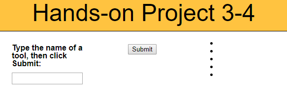

**This program takes input from a text box to a list on the web page.** 
* making decisions
* functions
* input element
* event-listener
* submit button

JavaScript code for this project - 

https://gist.github.com/dalbay/46ff12c30c97c1aa50c0b77c45e172a0#file-gistfile1-txt

// global variables
var daysOfWeek = ["Sunday", "Monday", "Tuesday", "Wednesday", 
   "Thursday", "Friday", "Saturday"];
var opponents = ["Lightning", "Combines", "Combines", 
    "Combines", "Lightning", "Lightning", "Lightning", 
    "Lightning", "Barn Raisers", "Barn Raisers", 
    "Barn Raisers", "Sodbusters", "Sodbusters", "Sodbusters",
    "Sodbusters", "(off)", "River Riders", "River Riders", 
    "River Riders", "Big Dippers", "Big Dippers", 
    "Big Dippers", "(off)", "Sodbusters", "Sodbusters",
    "Sodbusters", "Combines", "Combines", "Combines", 
    "(off)", "(off)"];
var gameLocation = 
   ["away", "away", "away", "away", "home", "home", "home",
    "home", "home", "home", "home", "away", "away", "away",
    "away", "", "away", "away", "away", "away", "away",
    "away", "", "home", "home", "home", "home", "home",
    "home", "", ""];

// function to place daysOfWeek values in header row cells 
function addColumnHeaders() {
   var i = 0;
   while (i < 7) {
      document.getElementsByTagName("th")[i].innerHTML = daysOfWeek[i];
      i++;
   }
}

// function to place day of month value in first p element 
// within each table data cell that has an id 
function addCalendarDates() {
   var i = 1;
   var paragraphs = "";
   do {
      var tableCell = document.getElementById("08-" + i);
      paragraphs = tableCell.getElementsByTagName("p");
      paragraphs[0].innerHTML = i;
      i++;      
   } while (i <= 31);
}

// function to place opponents and gameLocation values in 
// second p element within each table data cell that has an id
function addGameInfo() {
   var paragraphs = "";
   for (var i = 0; i < 31; i++) {
      var date = i+1;
      var tableCell = document.getElementById("08-" + date);
      paragraphs = tableCell.getElementsByTagName("p");
      if (gameLocation[i] === "away") {
         paragraphs[1].innerHTML = "@ ";
      } 
      if (gameLocation[i] === "home") {
         paragraphs[1].innerHTML = "vs ";
      }
/*      if (gameLocation[i] === "away") {
         paragraphs[1].innerHTML = "@ ";
      } 
      else {
         if (gameLocation[i] === "home") {
            paragraphs[1].innerHTML = "vs ";
         }
      } 
      /*switch (gameLocation[i]) {
         case "away":
            paragraphs[1].innerHTML = "@ ";
            break;
         case "home":
            paragraphs[1].innerHTML = "vs ";
            break;
      }*/
      paragraphs[1].innerHTML += opponents[i];
   }
}

// function to populate calendar 
function setUpPage() {
   addColumnHeaders();
   addCalendarDates();
   addGameInfo();
}

// runs setUpPage() function when page loads
if (window.addEventListener) {
   window.addEventListener("load", setUpPage, false);
} else if (window.attachEvent) {
   window.attachEvent("onload", setUpPage);
}

