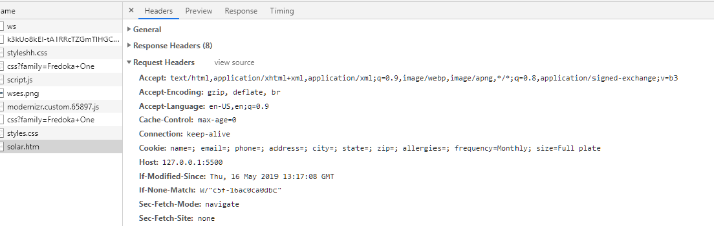
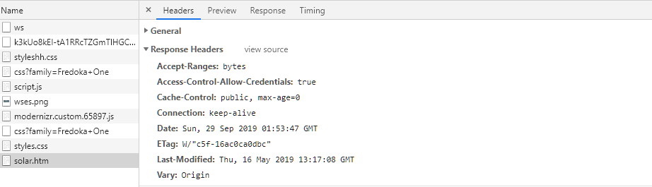

# Updating Web Pages With AJAX

## Introduction to Ajax
- Allows client web pages to quickly interact and exchange data with a web server *Without reloading entire web page*.
- Relies on Programming language such as ***JavaScript***; Data interchange format such as **JSON** or **XML**.
- **```XMLHttpRequest```** object **(XHR object)**
  Uses HTTP to exchange data between a client computer and a web server
  Can be used to request and receive data without reloading a web page
- Combining XMLHttpRequest with DHTML allows update and modification to individual portions of a web page with data received from a web server

### Understanding the Limitations of Ajax
Data requested can be located on a third-party server. The **same-origin policy** applies only to JavaScript and not to other programs running on a web server. This means that you can use a server-side script as a proxy to access data from another domain.  
*In computer terms, a ***proxy*** is a server that acts for or performs requests for other client and servers.*  
<br/>
The server-side proxy script can return the data to the client computer as it is requested with the ```XMLHttpRequest``` object. Proxy scripts is often written in PHP - *language specifically designed to run on web servers*.  

*Using a proxy remains a common technique for working around the same-origin policy to access third-party content.*  

### Accessing Content on a Separate Domain
The purpose of the same-origin policy is to prevent malicious scripts from modifiying the content of other windows, tabs, and frames, and to prevent the theft of private browser information and information displayed on secure web pages.  
However, the ability of one web server to access web pages and data on another web server is the foundation of the World Wide Web. Although you should never attempt to pass off content from another website as your own, there are legitimate reasons why you would use a server-side script to access data from another domain.  
One common use is to display data provided by a ***web service***, which is a data source available on one domain for use on other domains acorss the web. Web services provide services and data in response to requests that use the methods and properties of their APIs; it is up to the client accessing a web service to provide an implementation for a program that calls the web service.
<br/>  
***Widgets***:  
Instead of implementing an API to access and display content from a web service, some companies offer prepacked code known as **widgets** that enable to add content from the service to a web document. Widgets often contain code that uses Ajax to fetch and update content from the service.  
When you incorporate data from a web service into an app that runs in a browser, you need to know only which method of the web service to call for each type of commodity.  

### Running Ajax from a Web Server
- Opening a local file in a web browser requires the use of the ```file:///``` protocol. 
- Ajax relies on the XMLHttpRequest object to retreive data, you must open your Ajax file from a web server with the HTTP (```http://```) or HTTPS (```https://```) protocol. 
- Can install server software on any computer
- Popular web server software:
  - Apache HTTP Server
  - Nginx
  - Microsoft Internet Information Services (IIS)

## Working with HTTP
**Using Ajax to update data involves 4 steps:**
1. Instantiate an ```XMLHttpRequest``` object for the web browser where the script will run.
2. Use the ```XMLHttpRequest object to send a request to the server.
3. Receive the response from the server containing the requested data.
4. Process the data returned from the server, and incorporate the data into the app. 

### Understanding HTTP Messages
***HTTP messages :***  
- HTTP client requests and server responses
- HTTP client opens a connection to the server 
  - Submits a request message
  - Web server returns a response message appropriate to the request type

***Headers :***  
- Define information about the request or response message and about the contents of the message body
- Format for using a header:
```
    header: value
```
For example - the following lines define two generic headers that can be used in either request or response messages, Connection and Date:  
```
    Connection: close
    Date: Wed, 11 June 2019 13:32:04 GMT
```
***Cache-Control Header :***  
One generic header that requires special metion for Ajax applications is the Cache-Control header, which specifies how a web browser should cache any server content it receives.  

- Caching :
  - Temporary storage of data for faster access
  - web browsers try to reduce the amount of data that needs to be retrieved from a server by caching retrieved data on a local computer.
  - If caching is enabled in a web browser, the web browser will attempt to locate any necessary data in its cache before making a request from a web server
  - this goes against the reason for using Ajax, which is dynamically update portions of a web page with the most recent data from a server. For this reason, you should always include the ```Cache-Control``` header when creating an Ajax connection, and you should assign it a value of ```no-cache```.
  - Include ```Cache-Control: no-cache```
- Blank line always follows last header line
  - Optional: message body can follow the blank line in the messages
- Most common types of HTTP requests
  - ```GET``` and ```POST```
- Other HTTP request methods
  - ```HEAD, DELETE, OPTIONS, PUT```, and ```TRACE```
- Can use browser tools to examine HTTP headers
<br/>
### Sending HTTP Requests
***GET method***  
- Used for standard web page requests
- Can have a query string or form data appended to the URL  

When requesting a URL, most web browsers include the headers listed in the next table:  
  
<br/>
***POST method***  
Similar to a GET request except that any submitted data is included in the message body immediately following the blank line after the last header To provide more information about the message body, requests made with the POST method usually include some of the headers listed in the next table:  
  
<br/>

### Receiving HTTP Response
***HTTP response messages***:  
- Takes the same format as request messages, except for the contents of the start line and headers.
- Instead of containing a request method, the start line (also known as the request line) returns the protocol and version of the HTTP server (such as HTTP/1.1) along with the status code and descriptive text. 
- Status codes format
  - 1xx: (informational) - Request received
  - 2xx: (success) - Request successful
  - 3xx: (redirection) - Request cannot be completed without further action
  - 4xx: (client error) - Request cannot be fulfilled due to a client error
  - 5xx: (server error) - Request cannot be fulfilled due to a server error


#### Requesting Server Data
- ```XMLHttpRequest``` object
  - Key to incorporating Ajax in JavaScript code
  - Allows use of use JavaScript and HTTP to exchange data between a web browser and a web server


#### Instantiating an XMLHttpRequest Object
- Use the XMLHttpRequest constructor   
    ```var httpRequest = new XMLHttpRequest();```
- Most JavaScript programmers use a series of nested ```try/catch``` statements
- Opening and closing HTTP connections is a bottleneck in page loading
- Can make Ajax programs faster by reusing an instantiated XMLHttpRequest object
```JavaScript
var curRequest = false;
var httpRequest;
function getRequestObject() {
   try {
      httpRequest = new XMLHttpRequest();
   }
  catch (requestError) { 
      document.getElementById("main").innerHTML = "Your↵
         browser does not support this content";
      return false;
   }
   return httpRequest;
}
if (!curRequest) {
   curRequest = getRequestObject();
}

```
#### Opening and Sending a Request
- Use the ```open()``` method with the instantiated ```XMLHttpRequest``` object to specify the request method (GET or POST) and URL
- ```open()``` method accepts three optional arguments - ```async, username, password```
- ```abort()``` method used to cancel any existing HTTP requests before beginning a new one
- ```send()```s method - submit the request to the server; accepts a single argument containing the message body
- POST requests more involved
  - Must manually build name-value pairs to submit
  - Must submit at least ```Content-Type``` header before ```send()``` method
  - Also should submit ```Content-Length``` header and ```Connection``` header

#### Receiving Server Data
- ```responseXML``` property - contains the HTTP response as an XML document only if server response includes the ```Content-Type``` header with a MIME type value of ```text/xml```
- ```responseText property``` - Contains the HTTP response as a text string
#### Processing XML Data in a Response
- Assign property values to document nodes
  - Assign value of responseXML property to a variable
  - Use innerHTML and node properties to assign values of XML document stored in variable to appropriate elements
#### Processing Text Data in a Response
- ```responseText``` value almost always a JSON string
  - First use ```JSON.parse()``` to convert to object
  - Then access property values of new object and add to DOM elements

#### Sending and Receiving Synchronous Requests and Responses
- Synchronous request 
  - Stops the processing of the JavaScript code until a response returned from the server
  - Check ```XMLHttpRequest``` object’s ```status``` property value
    - Ensure response received successfully
- Synchronous responses 
  - Easier to handle; drawback is that script will not continue processing until the response is received
#### Sending and Receiving Asynchronous Requests and Responses
- Asynchronous request 
  - Allows JavaScript to continue processing while it waits for a server response
- Create an asynchronous request
  - Pass a value of ```true``` as the third argument of the ```open()``` method, or omit the argument altogether
- Receive a response - Use the ```XMLHttpRequest``` object’s ```readyState``` property and ```onreadystatechange``` event
- Example:
```JavaScript
    stockRequest.abort();
    stockRequest.open("get","StockCheck.php?" + "checkQuote=" + tickerSymbol, true);
    stockRequest.send(null);
    stockRequest.onreadystatechange = fillStockInfo;
```
- Value assigned to the ```readyState``` property updated automatically according to the current statement of the HTTP request. If property assigned a value of 4 - response finished loading

- Example:
```JavaScript
function fillStockInfo() {
   if (stockRequest.readyState === 4 && stockRequest.status↵
      === 200) {
      var stockValues = stockRequest.responseText;
      document.getElementById("ticker").innerHTML =↵
         stockValues.ticker;
      ...
   }
}
```
#### Refreshing Server Data Automatically
- Automatically refresh data obtained from an HTTP server
  - Use JavaScript’s ```setTimeout()``` or ```setInterval()``` methods
    - Send request to the server
    - Read and process the data returned from the server

#### Creating Cross-Domain Requests Without a Proxy Server
- Two alternatives to proxies for working around same-origin policy
  - JSON-P (JSON with padding) - Requests JSON content using a script element rather than an XHR object
  - CORS (Cross-Origin Resource Sharing) - Server sends special response header that indicates data may be used on other domains


#### Updating Content with JSON-P
- script element not subject to same-origin policy
- Program running on web server returns content
  - JSON object treated as parameter for function call
  - Called function processes JSON object

- JSON-P URL generally consists of 2 parts:
  - Request information - URL of service, parameters
  - Callback query string - Keyword (usually "callback") & name of function to call
- JSON-P opens a security hole in your website
  - If data source compromised, content you receive is a potential attack route on your site
  - Use JSON-P only with web service you trust
- JSON-P exposes API key or password to end users
  - Use only with trusted users, such as employees
- Cross-domain request within an XHR object
- Part of XMLHttpRequest2 specification
  - Additional properties, methods, and events for XHR object
- Enables content provider to convey permission
  - Access-Control-Allow-Origin HTTP response header
    - Value includes requesting domain
  - XDomainRequest object (Microsoft)
    - Must check first if browser defines this object


---
##### The Whole Spectrum Energy Solution App:
For the Whole Spectrum Energy Solution app, you'll request and use data from forecast.io, a web service that provides real-time weather data, including a forecast, for a specified location. A forecast.io request has the following format:  
``` https://api.forecast.io/forecast/apikey/latitude,longitude```  
<br/>
The **apikey** term represents an API key, which is a unique identifier assigned by the service to each person or organization that wants to access the service. Unlike Google Maps, which allows a limited number of requests per day without an API key, all forecast.io requests must include an API key.  
<br/>
The latitude and longitude terms represent latitude and longitute values provided as positive or negative floating-point numbers.  
The data returned by forecast.io is a string representation of a JSON object. You can use the ```JSON.parse()``` method to convert the returned string to a JavaScript object.  
<br/>
This web app will rely on a server-side script as a proxy to retreive weather infromation from forecast.io. This script is written in **PHP**, which is a programming language specifically designed to run on web servers. Your PHP proxy script executes when it is passed latitude and longitude values with the ```XMLHttpRequest``` object. After the PHP script retrieves the weather infromation for the specified coordinates, it returns the data to the JavaScript code that called it.  
PHP code to retreive data from the forecast.io service:
```PHP
    <?php
    $WeatherSource = "https://api.forecast.io/forecast/apikey/" . $_GET["lat"] . "," . $_GET["lng"];
    header("Content-Type: application/json");
    header("Cache-Control: no-cache");
    readfile($WeatherSource);
    ?>
```
1. First, move your data files onto your web server
2. Open the solar.html and script.js in text editor.
   - solar.html includes a mostly empty table
   - script.js:
     - declares 2 global variables
     - getWeather() function and declares event listeners - the event listeners call the getWeather() functions when a user clicks one of the three location buttons, as well as the page loads.
     - The getWeather() function checks if a button was clicked, and if so, uses the button text as the value of the selectCity variable. 
     - It then sets values for the latitude and longitude local variables based on the selectedCity value  
     You'll complete the function to submit Ajax request to forecast.io using the latitude and longitute values to get weather forecast data for the relevant city. 
3. Open solar.html in the browser and examine the network requests and responses related to the current document.

4. Examine the request header in your developer tools:

5. Examine the response headers using developer tools:   
  
<br/>
Here we saw the basics of HTTP requests and reponses.  
Examine the solar.php file, which you'll use as a proxy for your cross-domain request. You'll then request your own API key from the forecast.io web service, and you'll finalize the solar.php file by incorporating your API key into the URL for the HTTP request. 
6. Obtain an API key for forecast.io and incorporate it into the solar.php file:
   - open solar.php
   - Line 2 replace the placeholder 'apikey' with an actual API key.
   - Line 6 uses the PHP readfile() function to return the forecast data as the body of the HTTP response.
   - register to developer.forecast.io; copy the API key; replace it with the placeholder in your proxy file
Your final configuration of the PHP file for your proxy server should look like this:
```PHP
    <?php
    $WeatherSource = "https://api.forecast.io/forecast/773920fad47b82d3eda1b1bfb2daf84a/" . $_GET["lat"] . "," . $_GET["lng"];
    header("Content-Type: application/json");
    header("Cache-Control: no-cache");
    readfile($WeatherSource);
    ?>
```
