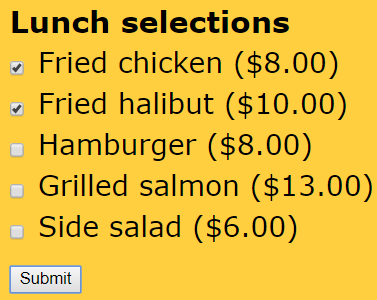
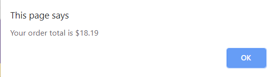

### Hands-On Project 2-4
Create a script that totals the price of all the elements a user selects; adds sales tax;  display the order total in an alert box:

 
 
 
```javascript
  <article>
      <h2>Lunch selections</h2>
      <form>
         <input type="checkbox" id="item1" value="8" />
         <label for="item1">Fried chicken ($8.00)</label>
         <input type="checkbox" id="item2" value="10" />
         <label for="item2">Fried halibut ($10.00)</label>
         <input type="checkbox" id="item3" value="8" />
         <label for="item3">Hamburger ($8.00)</label>
         <input type="checkbox" id="item4" value="13" />
         <label for="item4">Grilled salmon ($13.00)</label>
         <input type="checkbox" id="item5" value="6" />
         <label for="item5">Side salad ($6.00)</label>
         <input type="button" id="submit" value="Submit" />
      </form>
   </article>

   <script>
      function calcTotal(){
         var itemTotal = 0;
         var item1 = document.getElementById("item1");
         var item2 = document.getElementById("item2");
         var item3 = document.getElementById("item3");
         var item4 = document.getElementById("item4");
         var item5 = document.getElementById("item5");

         (item1.checked) ? (itemTotal += 8) : (itemTotal +=0 );
         (item2.checked) ? (itemTotal += 9) : (itemTotal += 0);
         (item3.checked) ? (itemTotal += 8) : (itemTotal += 0);
         (item4.checked) ? (itemTotal += 13) : (itemTotal += 0);
         (item5.checked) ? (itemTotal += 6) : (itemTotal += 0);

         var salesTaxRate = 0.07;
         var orderTotal = itemTotal + (itemTotal * salesTaxRate);

      window.alert("Your order total is $"+orderTotal);
      }
      //Add the event listener:
      document.getElementById("submit").addEventListener("click",calcTotal,false);
   </script>
```
