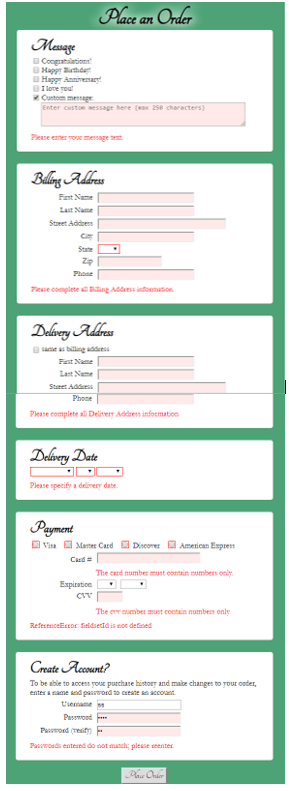

## CHAPTER 6 – Enhancing and Validating Form
### Using JavaScript with Forms
* Referencing Forms and Form Elements
### Improving Form Usability
* Designing Forms to Collect More Accurate Content
* Programming Forms to Increase Content Accuracy
* Dynamically Updating Selection List Values
* Adding Placeholder Text for Older Browsers
* Automatically Updating an Associated Field Based on a User Entry
* Transferring Duplicate Field Values
### Customizing Browser-Based Validation
* Specific Browser-Based Validation Parameters
* Customizing Browser-based Validation Feedback
### Programming Custom Validation
* Validating Submitted Data
* Validate Required Fields with Custom Functions
* Validating Dependent Fields with Custom Functions
* Validating Content Type with Custom Functions

