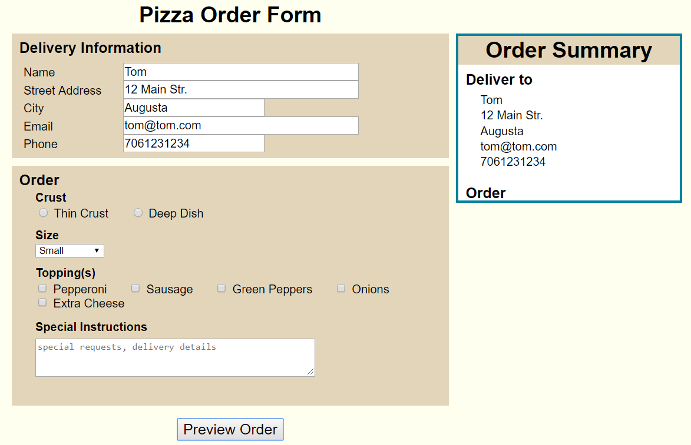

```javascript
   <article>
      <h2>Pizza Order Form</h2>
      <div id="errorMessage"></div>
      <form novalidate="novalidate">
         <fieldset id="deliveryinfo">
            <legend>Delivery Information</legend>
            <label for="nameinput">Name</label>
            <input type="text" id="nameinput" name="name" required="required" />
            <label for="addrinput">Street Address</label>
            <input type="text" id="addrinput" name="address" required="required" />
            <label for="cityinput">City</label>
            <input type="text" id="cityinput" name="city" required="required" />
            <label for="emailinput">Email</label>
            <input type="email" id="emailinput" name="email" required="required" />
            <label for="phoneinput">Phone</label>
            <input type="text" id="phoneinput" name="phone" required="required" />
         </fieldset>
         <fieldset id="orderinfo">
            <legend>Order</legend>
            <fieldset id="crustbox">
               <legend>Crust</legend>
               <input type="radio" name="crust" id="thin" value="Thin" />
               <label for="thin">Thin Crust</label>
               <input type="radio" name="crust" id="thick" value="Deep Dish" />
               <label for="thick">Deep Dish</label>
            </fieldset>
            <fieldset id="sizebox">
               <legend>Size</legend>
               <select id="size" name="size" required="required">
                  <option value="Small">Small</option>
                  <option value="Medium">Medium</option>
                  <option value="Large">Large</option>
                  <option value="XL">Extra Large</option>
               </select>
            </fieldset>
            <fieldset id="toppingbox">
               <legend>Topping(s)</legend>
               <input type="checkbox" id="pepperoni" name="toppings" value="Pepperoni" />
               <label for="pepperoni">Pepperoni</label>
               <input type="checkbox" id="sausage" name="toppings" value="Sausage" />
               <label for="sausage">Sausage</label>
               <input type="checkbox" id="greenpep" name="toppings" value="Green Peppers" />
               <label for="greenpep">Green Peppers</label>
               <input type="checkbox" id="onion" name="toppings" value="Onions" />
               <label for="onion">Onions</label>
               <input type="checkbox" id="xcheese" name="toppings" value="Extra Cheese" />
               <label for="xcheese">Extra Cheese</label>
               <label for="instructions" id="instrlabel">Special Instructions</label>
               <textarea id="instructions" name="instructions" rows="3" cols="50" placeholder="special requests, delivery details"></textarea>
            </fieldset>
         </fieldset>
         <fieldset id="previewbutton">
            <input type="button" id="previewBtn" value="Preview Order" />
         </fieldset>
      </form>
      <section>
         <h2>Order Summary</h2>
         <h3>Deliver to</h3>
         <div id="deliverTo"></div>
         <h3>Order</h3>
         <div id="order"></div>
      </section>
   </article>
   
   "use strict";

//global variables
var delivInfo = {};  //empty object
var delivSummary = document.getElementById("deliverTo");   //this will be populated in the order summary section

// This function will add the value of each input field to the delivInfo object as a property value.
function processDeliveryInfo(){
    // local variable
    var prop;
    //store the values of the input field
    delivInfo.name = document.getElementById("nameinput").value;
    delivInfo.addr = document.getElementById("addrinput").value;
    delivInfo.city = document.getElementById("cityinput").value;
    delivInfo.email = document.getElementById("emailinput").value;
    delivInfo.phone = document.getElementById("phoneinput").value;

    //add the value of the property to the content of the deliverTo element
    for(prop in delivInfo){
        if(delivInfo[prop] !== ""){
            delivSummary.innerHTML += "<p>" + delivInfo[prop] + "</p>";
        }        
    }
}

// function that will call the processDeliveryInfo(), and displays the section element
function previewOrder(){
    processDeliveryInfo();
    document.querySelector("section").style.display = "block";
    document.querySelector("section div").style.display = "block";
}

// Create an event listener on the element with the id value previewBtn. 
// The click event should call the previewOrder() function
function createEventListeners(){
    var previewButton = document.getElementById("previewBtn");
    if(previewButton.addEventListener){
        previewButton.addEventListener("click",previewOrder,false);
    }else if(previewButton.attachEvent){
        previewButton.attachEvent("onclick",previewOrder);
    }
}

// add the statements to run the function that creates the event listener when the 
// page finishes loading.
if(window.addEventListener){
    window.addEventListener("load",createEventListeners,false);
}else if(window.attachEvent){
    window.attachEvent("onload",createEventListeners);
}
   
```
