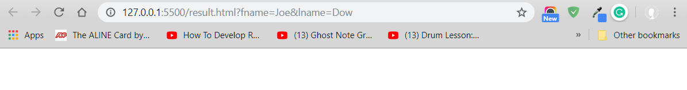
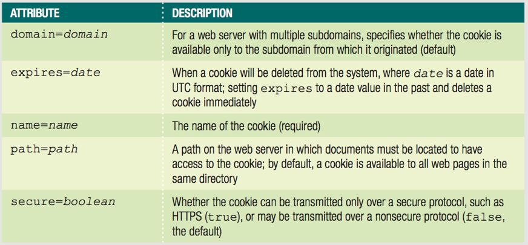
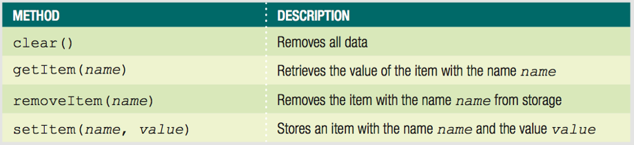

# Managing State and Information Security

* Save state information with query strings, hidden form fields, and cookies
* Describe JavaScript security issues and employ coding practices designed to address them

## Understanding State Information

* State information
  – Information about individual visits to a Web site
* HTTP original design: stateless
  –	No persistent data about site visits stored
* Reasons for maintaining state information
  –	Customize individual web pages
  –	Store information within a multipart form
  –	Provide shopping carts

### Saving State Information with Query Strings

* Query string
  –	Set of name-value pairs
* Appended to a target URL
  –	Consists of a single text string
* Contains one or more pieces of information
* Passes information from one web page to another

#### Passing data with a Query String

- Add a question mark (?) immediately after a URL; followed by the query string (in name-value pairs) for the information to preserve
- Ampersands (&) - separates individual name-value pairs within the query string
*Example:*
```html
<a href="http://www.example.com/↵ 
   addItem.html?isbn=9780394800165&quantity=2">Order Book</a>
 ```
 ---
**Example :** Passing data to another page with HTML ```<form>``` Tags **```action```** attribute.
```HTML
        <form action="result.html" name="userInput" method="GET" target="_blank" >
            <fieldset>
                First Name: <input type="text" id="name" name="fname">
                Last Name:  <input type="text" id="lname" name="lname">
                <input type="submit" class="btnSubmit" value="Submit">
                <input type="submit" class="btnSubmit" formaction="/result2.html" value="Submit to another page">
            </fieldset>
        </form> 
```

- When you click the submit button, the data you typed in the input tags will be added as a key/value pair to the query string.


#### Parsing Data from a Query String
- Passed query string assigned to target web page Location object search property
  - The *Location object* contains information about the current URL.
  –	The *search property* of the Location object contains a URL’s query or search parameters including the (?)
  **Example :**
```JavaScript
// Get the query string by assigning it to a variable
var queryData = location.search;
console.log(queryData);
// OUTPUT:
// ?fname=Joe&lname=Dow
```
- Remove the question mark - Using the *substring() method* combined with the *length property*
```JavaScript
// Remove the opening question mark from the string
queryData = queryData.substring(1,queryData.length);
console.log(queryData);
// OUTPUT:
// fname=Joe&lname=Dow
```
- Convert individual pieces of information into array elements - Using the *split() method*
```JavaScript
//Convert individual pieces of information into array elements
var queryArray = queryData.split("&");
console.log(queryArray);
/* OUTPUT:
(2) ["fname=Joe", "lname=Dow"]
0: "fname=Joe"
1: "lname=Dow"
length: 2
__proto__: Array(0)
 */
```
---
##### Example
Create a function that parses the query string and stores the result in an array when page loads up.
```JavaScript
// interpret the document content in strict mode
"use strict";

// global variable
var queryArray = [];

// function to parse the query string and store the result in an array.
function populateInfo() {
   // checks if the search property of the Location object has a value;
   if (location.search) {
      var queryData = location.search;
      // copy all but the first character (?) from the queryData variable
      queryData = queryData.substring(1, queryData.length);
      // extract each name-value pair from the queryData variable and assign it as an element in the queryArray variable
      queryArray = queryData.split("&");
   }
}

// run the populateInfo function when the page finishes loading. 
if (window.addEventListener) {
   window.addEventListener("load", populateInfo, false);
} else if (window.attachEvent) {
   window.attachEvent("onload", populateInfo);
}
```
---
### Saving State Information with Hidden Form Fields
- Hidden form field
  - Special type of form element
  - Not displayed by web browser
  - Syntax: ```<input type="hidden">```
 ```HTML
     <form>
        <input type="hidden" id="fname" name="fname" />
        <input type="hidden" id="lname" name="lname" />
    </form>
 ```
 ```JavaScript
           // declare the hiddenInputs variable (reference to all the hidden fields)
          var hiddenInputs = document.querySelectorAll('input[type=hidden]');
          // assign each name-value pair as an element in the queryArray variable
          for(var i = 0; i < queryArray.length; i++){              
              hiddenInputs[i].value = queryArray[i].substring(queryArray[i].lastIndexOf("=")+1);

          }
          console.log(hiddenInputs[0].value);
          console.log(hiddenInputs[1].value);
		  // OUTPUT:
		  // app.js:38 Joe
		  // app.js:39 Dow
 ```
 ---
##### Example
Enhance the populateInfo() function to assign values from the queryArray array to the **hidden fields**
```JavaScript
function populateInfo() {
   // checks if the search property of the Location object has a value;
   if (location.search) {
      var queryData = location.search;
      // declare the hiddenInputs variable (reference to all the hidden fields)
      var hiddenInputs = document.querySelectorAll("input[type=hidden]");
      // copy all but the first character (?) from the queryData variable
      queryData = queryData.substring(1, queryData.length);
      // extract each name-value pair from the queryData variable and assign it as an element in the queryArray variable
      queryArray = queryData.split("&");
      for (var i = 0; i < queryArray.length; i++) {
         hiddenInputs[i].value = queryArray[i].substring(queryArray[i].lastIndexOf("=") + 1);
      }
   }
}
```
---
## Storing State Information
### Storing State Information with Cookies
*Query strings and hidden form fields temporarily maintain state information*
- Cookies:
  - Small pieces of information about a user
  - Stored by a web server in text files
  - Stored on the user’s computer
  - Saved cookies sent from client to the server
  - *Temporary Cookies* - Available only for current browser session
  - *Persistent Cookies* - Stored in a text file on client computer
  - Creates cookies in name-value pairs
  - Syntax - ```document.cookie = name + "=" + value;```
  - Cookie property created with a required name attribute and four optional attributes:
    - expires, path, domain, secure


#### Creating and Modifiying Cookies
- Cookies cannot include semicolons or special characters
- Encoding involves converting special characters in a text string
- *```encodeURIComponent()```* function
  - Converts special characters in the individual parts of a URI to corresponding     
    hexadecimal ASCII value
  - Syntax: ```encodeURIComponent(text)```
- *```decodeURIComponent()```* function
  - Counterpart of encodeURIComponent() function
  - Syntax: ```decodeURIComponent(text)```  
- *```expires```* attribute
  - Determines how long a cookie can remain on a client system before being deleted
  - Cookies created without this attribute are available current browser session only
  - Syntax: ```expires=date```
  - Can manually type a string in UTC format or:
	- Can create string with the Date object
  - Use the toUTCString() method to convert the Date object to a string
##### Example: Creating Cookie with expiresDate attribute & decodeURIComponent() function
Create cookies containing the *form field names* and *their values*:
```JavaScript
function createCookies() {
    var formFields = document.querySelectorAll('input[type=hidden]');
    var expiresDate = new Date();
    // add 7 days to expire cookie
    expiresDate.setDate(expiresDate.getDate() + 7);
    for (var i = 0; i < formFields.length; i++) {
        // decode special characters
        var currentValue = decodeURIComponent(formFields[i].value);
        // create the cookies   
        document.cookie = formFields[i].name + "=" + encodeURIComponent(currentValue) + "; expires=" + expiresDate.toUTCString();
    }
}
// Function to handle the submit
// this function prevents the form from being submitted immediately, then calls the createCookies function,
// and then fires the submit event on the form.
function handleSubmit(e) {
    e.preventDefault();
    createCookies();
    document.getElementsByTagName("form" [0].submit());
}
// create an event handler to call the handleSubmit function when the form is submitted.
function createEventListeners() {
    var form = document.getElementsByTagName("form")[0];
    form.addEventListener("submit", handleSubmit, false);
}
// create an event handler for the form that calls the handleSubmit() function
function setUpPage() {
    createEventListeners();
    getQueryString();
    parseData();
}
// when page finishes loading ->
if (window.addEventListener) {
    window.addEventListener("load", setUpPage, false);
} else if (window.attachEvent) {
    window.attachEvent("onload", setUpPage);
}

```
---
##### Example : Create a function to parse and display data from the query string on a html page.
```JavaScript
//Create a function to parse and display data from the query string on a html page.
function parseData() {
   //encode characters with their character equivalents first.
   var formData = decodeURIComponent(location.search);
   var formArray = [];
   var list = document.querySelector("div.results ul");
   formData = formData.substring(1, formData.length);
   while (formData.indexOf("+") !== -1) {
      formData = formData.replace("+", " ");
   }
   formData = decodeURIComponent(formData);
   formArray = formData.split("&");
   for (var i = 0; i < formArray.length; i++) {
      var newItem = document.createElement("li");
      newItem.innerHTML = formArray[i];
      list.appendChild(newItem);
   }
 }
// calls parseData when page finishes loading
if (window.addEventListener) {
   window.addEventListener("load", parseData, false);
} else if (window.attachEvent) {
   window.attachEvent("onload", parseData);
}
```
---
#### Configuring Availability of Cookies to Other Web Pages on the Server

- use **path** attribute - determines the availability of a cookie to other web pages on a server.
- The path attribute is assigned to the cookie property, along with an associated name-value pair, the syntax -```path=path```.
- Default: cookie available to all web pages in the same directory
- To make cookie available to all directories on a server Use a slash
- **Example:**
```JavaScript
	var username = document.getElementById("username").value; 
	document.cookie = "username=" + encodeURIComponent(username + "; path=/advertising");
```
**Note**:Cookies from other programs stored in the same directory can cause JavaScript program to run erratically.

#### Sharing Cookies Across a Domain
- Some web sites are very large and use number of servers. 
- Sharing cookies across multipe servers use **domain** attribute; the syntax - ```domain=domain```.
- Cannot share cookies outside of a domain
- **Example:**
```JavaScript
	var username = document.getElementById("username").value; 
	document.cookie = "username=" + encodeURIComponent(username + "; domain=.example.com");
```

#### Securing Cookie Transmissions
The main protocol used to encrypt data on web sites is Secure Socket Layer, or SSL which will eventually be replaced by Transport Layer Security (TLS). Both SSL and TLS encryption can be used to prevent a man-in-the-middle attach, in which data being exchanged between two parties is read and potentially changed in transit. 
- **secure** attribute indicates that cookie can only be transmitted across a secure Internet connection; using HTTPS or another security protocol
- **Example:**
```JavaScript
	var username = document.getElementById("username").value; 
	document.cookie = "username=" + encodeURIComponent(username + "; secure=true");
```
#### Reading Cookies with JavaScript
The cookies for a particular web page are available in the cookie property  of the Document object. Each cookie consists of one continues string that must be parsed before that data it contains can be used. Parsing a cookie is a two-step process:
- Decode it using decodeURIComponent() function
- Use the String object methods to extract individual name-value pairs
Parsing is similar to query string parsing, except that there is no question mark to remove and individual cookies are separated by a semicolon and a space instead of amperasands.
- **Example:**
  - Create three encoded cookies
  - Read them from the cookie property, decode them
  - Use the split() method to copy each name-value pair into cookieArray[] array elements
  - Determine which cookie holds needed value
    - for loop to cycle through array elements
	- if statement to check name portion of each name-value pair
```JavaScript
	// create the coockies
	document.cookie = "username=" + encodeURIComponent(username);
	document.cookie = "member=" + encodeURIComponent(member); 
	document.cookie = "audio=" + encodeURIComponent(audio);
	// read & decode
	var cookieString = decodeURIComponent(document.cookie);
	// copy each name-value pair
	var cookieArray = cookieString.split("; ");
	
	// determine which cookie holds needed value
	var currentUsername;
	var unBox = document.getElementById("username");
	for (var i = 0; i < 3; i++) {
	   currentUsername = cookieArray[i];
	   if(currentUsername.substring(0,currentUsername.indexOf("=")) === "username") {
		  unBox.value = currentUsername.substring(currentUsername.indexOf("=") + 1,currentUsername.length);
		  break;
	   }
	}

```
#### Deleting Cookies
When a user closes a browser tab or window, any temporary cookie associated with the session are deleted, while persistent cookies remain on the user's computer until they expire. In some cases, however, persistent cookies need to be deleted.
- **Deleting Cookies with JavaScript** : you must set its expiration to a date in the past.  
**Example**:
```JavaScript
	var expiresDate = new Date();
	var username = document.getElementById("username").value;
    // set the expires attribute to one week ago will delete the cookie
	expiresDate.setDate(expiresDate.getDate() - 7);   
	document.cookie = "username=" + encodeURIComponent(username) + "; expires=" + expiresDate.toUTCString();
```
- **Deleting Cookies from Your Browser** : Ctrl + H in Chrome


### Storing State Information with the Web Storage API
- Web Storage:
  - functionallity to browsers by creating a standard to replace cookies.
  - not supported by older browsers
  - Cookies are still the standard  
  - Storing/reading Web Storage easier than cookies

- Web Storage includes two properties of Window object
  - **```localStorage```** - remains until you code to delete it; similar to persistent cookies
  - **```sessionStorage```** - removed automatically when user closes browser tab or window; like temporary cookies
    

  Example:
  ```JavaScript
    localStorage.setItem(fname, firstName);
    localStorage.removeItem(fname);
  ```

## Understanding Security Issues
- Security threats - Viruses, worms, data theft by hackers
- Consider web server security and secure coding.
  - Web server security technologies - Firewalls; Secure Socket Layer (SSL)
  - secure coding/defensive coding - refer to writing code in a way that minimizes any intentional or accidential security issues.
- JavaScript programs downloaded and execute locally

#### JavaScript Security Concerns
1. Protection of a web page and JavaScript prgram against malicious tampering
   - **Code Injection attack**: JavaScript code that is not written securely is vulnerable to a code injection attack, in which a program or user enters JavaScript code that changes the function of the web page.  
(For instance, a malicious program could open a web page containing a form and enter JavaScript code in one of the form fields designed to retrieve sensitive information from the server. Such a program could then relay this infromation to a person other than the owner.)
  - Validating forms before submission is an important part of preventing injection attacks.
  - Escape characters in form field values that could be part of malicious code, which involves converting the characters to their character code equivalents, as you do when URL encoding cookie data. For form input, escaping is generally performed by the web server before processing user input. 
2. Privacy of individual client information in the web browser window.
   - Your contact information and and browsing history are valuable pieces of information that many advertisers would like to access. Without security restrictions, a JavaScript program could read this infromation from your web browser. 
3. Protection of the local file system of the client or web site from theft or tampering 
**Important JavaScript security featue:**
  - Lack of certain type of functionality:
    - File manipulation - JavaScript does not allow any file manipulation aside from cookies, Web Storage, and a few other emerging standards, which are site specific. This prevents mischevious scripts from stealing information or causing damage by changing or deleting files; (certain programming languages include objects and methods that make it possible for a program to read, write, and delete files.)
    - Create a network connection - this limitation prevents JavaScript programs from infiltration a private network or intranet from which information may be stolen or damaged.
    - Cannot run system commands or execute programs on a client.

#### The Same Origin Policy
Another JavaScript security feature restricts how a JavaScript code in one window, tab, or frame accesses a web page in another window, tab, or frame on a client computer. Under the **same origin policy**, windows, tabs, and frames can view and modify the elements and properties of documents displayed in other windows, tabs, and frames only if they share the same protocol (such as HTTP) and exist on the same web server.  
The same origin policy prevents malicious scripts from modifying the content of other windows and tabs and prevents the theft of private browser information and information displayed on secure web pages.  
For example, documents from the following two domains cannot access each other's elements and properties because they use different protocols.
``` http://www.example.com
	https://www.example.com
```

In some circumstances, you might want two documents from related web sites on different servers to be able to access each other's elements and properties. To allow documents from different origins in the same domain to access each other's elements and properties, you use the ```domain``` property of the ```Document``` object. The **```domain property```** of the ```Document``` object changes the origin of a document to its root domain name by using the statement:
- ```JavaScript 
	document.domain = "domain"  
```
Adding the statement ```document.domain = "example.com";``` to documents from both marketing.example.com and content.example.com allows the documents to access each other's elements and properties, even though they are located on different servers. 

#### Using Third-Party Scripts
In some cases you want scripts from other domains, known as **third-party scripts**, to be able to run on your web page. For instance, some companies provide widgets, that you can add to your web pages but that run from the provider's web server. Another common situation requiring third-party scripts is the use of a **content delivery network (CDN), which is a company that maintains web services optimized for fast delivery of content.  
To enable a third-party script in a web document, you simply include a script element with a src value pointing to the third-party content. 


### NOTES ON: HTML ```<form>``` Tag
The ```<form>``` element can contain one or more of the following form elements:

* ```<input>```
* ```<textarea>```
* ```<button>```
* ```<select>```
* ```<option>```
* ```<optgroup>```
* ```<fieldset>```
* ```<label>```
* ```<output>```

| Attribute        | Value           | Description  |
| ------------- |:-------------:| -----:|
|accept	|file_type	|Not supported in HTML5. Specifies a comma-separated list of file types  that the server accepts (that can be submitted through the file upload)|
|accept-charset|character_set|	Specifies the character encodings that are to be used for the form submission|
|action	|URL	|Specifies where to send the form-data when a form is submitted|
|autocomplete|	on / off |Specifies whether a form should have autocomplete on or off|
|enctype	|application/x-www-form-urlencoded multipart/form-data text/plain| Specifies how the form-data should be encoded when submitting it to the server (only for method="post")|
|method	|get post|	Specifies the HTTP method to use when sending form-data|
|name	|text	|Specifies the name of a form|
|novalidate|	novalidate	|Specifies that the form should not be validated when submitted|

#### HTML <form> method Attribute
##### Notes on GET:
- Appends form-data into the URL in name/value pairs
- The length of a URL is limited (about 3000 characters)
- Never use GET to send sensitive data! (will be visible in the URL)
- Useful for form submissions where a user want to bookmark the result
- GET is better for non-secure data, like query strings in Google
##### Notes on POST:
- Appends form-data inside the body of the HTTP request (data is not shown is in URL)
- Has no size limitations
- Form submissions with POST cannot be bookmarked


