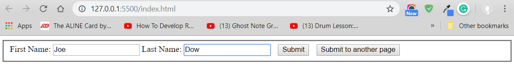

## Managing State and Information Security

* Save state information with query strings, hidden form fields, and cookies
* Describe JavaScript security issues and employ coding practices designed to address them

### Understanding State Information

* State information
  – Information about individual visits to a Web site
* HTTP original design: stateless
  –	No persistent data about site visits stored
* Reasons for maintaining state information
  –	Customize individual web pages
  –	Store information within a multipart form
  –	Provide shopping carts

#### Saving State Information with Query Strings

* Query string
  –	Set of name-value pairs
* Appended to a target URL
  –	Consists of a single text string
* Contains one or more pieces of information
* Passes information from one web page to another

##### Passing data with a query string

- Add a question mark (?) immediately after a URL; followed by the query string (in name-value pairs) for the information to preserve
- Ampersands (&) - separates individual name-value pairs within the query string
*Example:*
```html
<a href="http://www.example.com/↵ 
   addItem.html?isbn=9780394800165&quantity=2">Order Book</a>
 ```
 ---
**Example :** Passing data to another page with HTML ```<form>``` Tags **```action```** attribute.
```HTML
        <form action="result.html" name="userInput" method="GET" target="_blank" >
            <fieldset>
                First Name: <input type="text" id="name" name="fname">
                Last Name:  <input type="text" id="lname" name="lname">
                <input type="submit" class="btnSubmit" value="Submit">
                <input type="submit" class="btnSubmit" formaction="/result2.html" value="Submit to another page">
            </fieldset>
        </form> 
```

- When you click the submit button, the data you typed in the input tags will be added as a key/value pair to the query string.


##### Parsing Data from a Query String
- Passed query string assigned to target web page Location object search property
  - The *Location object* contains information about the current URL.
  –	The *search property* of the Location object contains a URL’s query or search parameters including the (?)
  **Example :**
```JavaScript
// Get the query string by assigning it to a variable
var queryData = location.search;
console.log(queryData);
// OUTPUT:
// ?fname=Joe&lname=Dow
```
- Remove the question mark - Using the *substring() method* combined with the *length property*
```JavaScript
// Remove the opening question mark from the string
queryData = queryData.substring(1,queryData.length);
console.log(queryData);
// OUTPUT:
// fname=Joe&lname=Dow
```
- Convert individual pieces of information into array elements - Using the *split() method*
```JavaScript
//Convert individual pieces of information into array elements
var queryArray = queryData.split("&");
console.log(queryArray);
/* OUTPUT:
(2) ["fname=Joe", "lname=Dow"]
0: "fname=Joe"
1: "lname=Dow"
length: 2
__proto__: Array(0)
 */
```
---
##### Example
Create a function that parses the query string and stores the result in an array when page loads up.
```JavaScript
// interpret the document content in strict mode
"use strict";

// global variable
var queryArray = [];

// function to parse the query string and store the result in an array.
function populateInfo() {
   // checks if the search property of the Location object has a value;
   if (location.search) {
      var queryData = location.search;
      // copy all but the first character (?) from the queryData variable
      queryData = queryData.substring(1, queryData.length);
      // extract each name-value pair from the queryData variable and assign it as an element in the queryArray variable
      queryArray = queryData.split("&");
   }
}

// run the populateInfo function when the page finishes loading. 
if (window.addEventListener) {
   window.addEventListener("load", populateInfo, false);
} else if (window.attachEvent) {
   window.attachEvent("onload", populateInfo);
}
```
---
#### Saving State Information with Hidden Form Fields
- Hidden form field
  - Special type of form element
  - Not displayed by web browser
  - Syntax: ```<input type="hidden">```
 ```HTML
     <form>
        <input type="hidden" id="fname" name="fname" />
        <input type="hidden" id="lname" name="lname" />
    </form>
 ```
 ```JavaScript
           // declare the hiddenInputs variable (reference to all the hidden fields)
          var hiddenInputs = document.querySelectorAll('input[type=hidden]');
          // assign each name-value pair as an element in the queryArray variable
          for(var i = 0; i < queryArray.length; i++){              
              hiddenInputs[i].value = queryArray[i].substring(queryArray[i].lastIndexOf("=")+1);

          }
          console.log(hiddenInputs[0].value);
          console.log(hiddenInputs[1].value);
		  // OUTPUT:
		  // app.js:38 Joe
		  // app.js:39 Dow
 ```
 ---
##### Example
Enhance the populateInfo() function to assign values from the queryArray array to the **hidden fields**
```JavaScript
function populateInfo() {
   // checks if the search property of the Location object has a value;
   if (location.search) {
      var queryData = location.search;
      // declare the hiddenInputs variable (reference to all the hidden fields)
      var hiddenInputs = document.querySelectorAll("input[type=hidden]");
      // copy all but the first character (?) from the queryData variable
      queryData = queryData.substring(1, queryData.length);
      // extract each name-value pair from the queryData variable and assign it as an element in the queryArray variable
      queryArray = queryData.split("&");
      for (var i = 0; i < queryArray.length; i++) {
         hiddenInputs[i].value = queryArray[i].substring(queryArray[i].lastIndexOf("=") + 1);
      }
   }
}
```
---
### Storing State Information
#### Storing State Information with Cookies
*Query strings and hidden form fields temporarily maintain state information*
- Cookies:
  - Small pieces of information about a user
  - Stored by a web server in text files
  - Stored on the user’s computer
  - Saved cookies sent from client to the server
  - *Temporary Cookies* - Available only for current browser session
  - *Persistent Cookies* - Stored in a text file on client computer
  - Creates cookies in name-value pairs
  - Syntax - ```document.cookie = name + "=" + value;```
  - Cookie property created with a required name attribute and four optional attributes:
    - expires, path, domain, secure


#### Creating and Modifiying Cookies
- Cookies cannot include semicolons or special characters
- Encoding involves converting special characters in a text string
- *```encodeURIComponent()```* function
  - Converts special characters in the individual parts of a URI to corresponding     
    hexadecimal ASCII value
  - Syntax: ```encodeURIComponent(text)```
- *```decodeURIComponent()```* function
  - Counterpart of encodeURIComponent() function
  - Syntax: ```decodeURIComponent(text)```  
- *```expires```* attribute
  - Determines how long a cookie can remain on a client system before being deleted
  - Cookies created without this attribute are available current browser session only
  - Syntax: ```expires=date```
  - Can manually type a string in UTC format or:
	- Can create string with the Date object
  - Use the toUTCString() method to convert the Date object to a string
##### Example: Creating Cookie with expiresDate attribute & decodeURIComponent() function
Create cookies containing the *form field names* and *their values*:
```JavaScript
function createCookies() {
    var formFields = document.querySelectorAll('input[type=hidden]');
    var expiresDate = new Date();
    // add 7 days to expire cookie
    expiresDate.setDate(expiresDate.getDate() + 7);
    for (var i = 0; i < formFields.length; i++) {
        // decode special characters
        var currentValue = decodeURIComponent(formFields[i].value);
        // create the coockies   
        document.cookie = formFields[i].name + "=" + currentValue + "; expires=" + expiresDate.toUTCString();
    }
}
// Function to handle the submit
// this function prevents the form from being submitted immediately, then calls the createCookies function,
// and then fires the submit event on the form.
function handleSubmit(e) {
    e.preventDefault();
    createCookies();
    document.getElementsByTagName("form" [0].submit());
}
// create an event handler to call the handleSubmit function when the form is submitted.
function createEventListeners() {
    var form = document.getElementsByTagName("form")[0];
    form.addEventListener("submit", handleSubmit, false);
}
// create an event handler for the form that calls the handleSubmit() function
function setUpPage() {
    createEventListeners();
    getQueryString();
    parseData();
}
// when page finishes loading ->
if (window.addEventListener) {
    window.addEventListener("load", setUpPage, false);
} else if (window.attachEvent) {
    window.attachEvent("onload", setUpPage);
}

```
---
##### Example : Create a function to parse and display data from the query string on a html page.
```JavaScript
//Create a function to parse and display data from the query string on a html page.
function parseData() {
   //encode characters with their character equivalents first.
   var formData = decodeURIComponent(location.search);
   var formArray = [];
   var list = document.querySelector("div.results ul");
   formData = formData.substring(1, formData.length);
   while (formData.indexOf("+") !== -1) {
      formData = formData.replace("+", " ");
   }
   formData = decodeURIComponent(formData);
   formArray = formData.split("&");
   for (var i = 0; i < formArray.length; i++) {
      var newItem = document.createElement("li");
      newItem.innerHTML = formArray[i];
      list.appendChild(newItem);
   }
 }
// calls parseData when page finishes loading
if (window.addEventListener) {
   window.addEventListener("load", parseData, false);
} else if (window.attachEvent) {
   window.attachEvent("onload", parseData);
}
```
---
#### Configuring Availability of Cookies to Other Web Pages on the Server
### NOTES ON: HTML ```<form>``` Tag
The ```<form>``` element can contain one or more of the following form elements:

* ```<input>```
* ```<textarea>```
* ```<button>```
* ```<select>```
* ```<option>```
* ```<optgroup>```
* ```<fieldset>```
* ```<label>```
* ```<output>```

| Attribute        | Value           | Description  |
| ------------- |:-------------:| -----:|
|accept	|file_type	|Not supported in HTML5. Specifies a comma-separated list of file types  that the server accepts (that can be submitted through the file upload)|
|accept-charset|character_set|	Specifies the character encodings that are to be used for the form submission|
|action	|URL	|Specifies where to send the form-data when a form is submitted|
|autocomplete|	on / off |Specifies whether a form should have autocomplete on or off|
|enctype	|application/x-www-form-urlencoded multipart/form-data text/plain| Specifies how the form-data should be encoded when submitting it to the server (only for method="post")|
|method	|get post|	Specifies the HTTP method to use when sending form-data|
|name	|text	|Specifies the name of a form|
|novalidate|	novalidate	|Specifies that the form should not be validated when submitted|

#### HTML <form> method Attribute
##### Notes on GET:
- Appends form-data into the URL in name/value pairs
- The length of a URL is limited (about 3000 characters)
- Never use GET to send sensitive data! (will be visible in the URL)
- Useful for form submissions where a user want to bookmark the result
- GET is better for non-secure data, like query strings in Google
##### Notes on POST:
- Appends form-data inside the body of the HTTP request (data is not shown is in URL)
- Has no size limitations
- Form submissions with POST cannot be bookmarked


